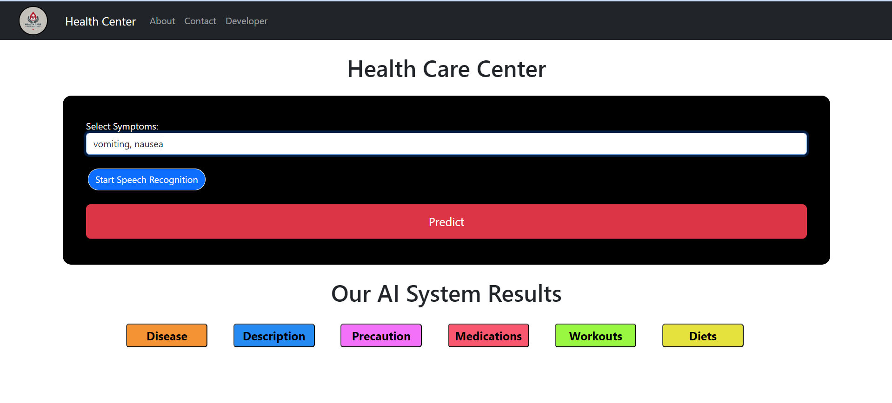
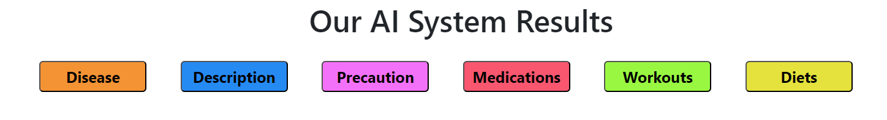
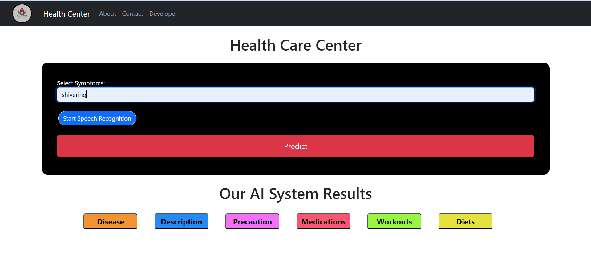
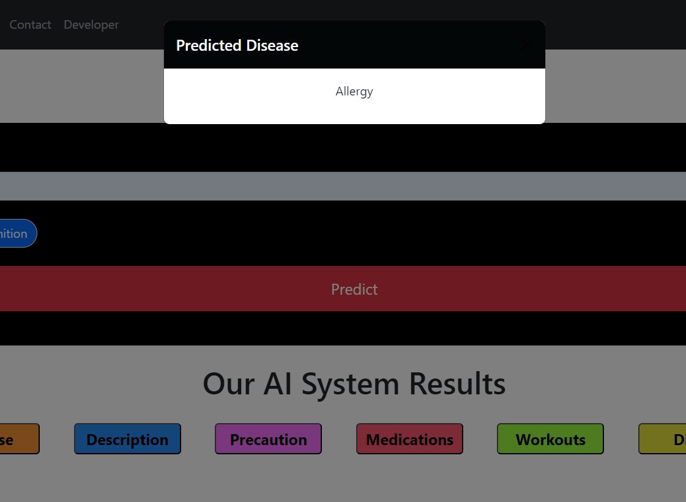

# Health Center

Welcome to the Health Center project, an innovative platform that harnesses the power of AI and machine learning to enhance healthcare accessibility and provide personalized medical recommendations. This project aims to revolutionize the way individuals manage their health by offering a user-friendly interface for uploading medical documents and receiving tailored advice.

## Table of Contents

1. [Environment Setup](#environment-setup)
2. [Dataset](#dataset)
3. [Project Overview](#project-overview)
4. [Technologies Used](#technologies-used)
5. [Project Images](#project-images)
6. [Acknowledgment](#acknowledgment)
7. [License](#license)

## Environment Setup

To set up the project, ensure you have Python 3.8 installed. Follow these steps:

1. **Create a virtual environment:**

    ```bash
    python3.8 -m venv venv
    ```

2. **Activate the virtual environment:**

    - On Windows:
    ```bash
    venv\Scripts\activate
    ```
    - On macOS/Linux:
    ```bash
    source venv/bin/activate
    ```

3. **Install the required packages:**

    ```bash
    pip install -r requirements.txt
    ```

## Dataset

The dataset used in this project is the [Medicine Recommendation System Dataset](https://www.kaggle.com/datasets/noorsaeed/medicine-recommendation-system-dataset) provided by Noor Saeed. This comprehensive dataset includes detailed information on various medicines and their recommended uses, forming the backbone of our recommendation system.

## Project Overview

Health Center offers a range of features designed to empower users with knowledge and personalized healthcare solutions:

- **Image Upload**: Users can easily upload images of their prescriptions or medical reports.
- **AI-Powered Recommendations**: Advanced machine learning models analyze the input data to provide accurate medicine recommendations.
- **Educational Resources**: The platform includes extensive information on health conditions and treatments, helping users make informed decisions.

## Technologies Used

- **Python 3.8** 
- **Flask** 
- **Bootstrap** 
- **Pandas** 
- **scikit-learn** 
- **NumPy** 

## Project Images









## Acknowledgment

We extend our gratitude to Noor Saeed for providing the Medicine Recommendation System Dataset, which is instrumental to this project.

## License

This project is licensed under the MIT License. See the LICENSE file for more details.
